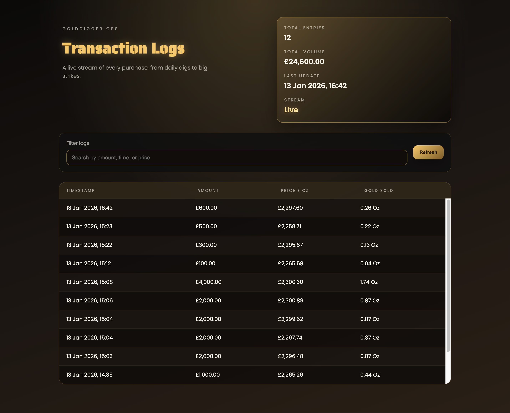

# Gold Digger - Solo Project

Gold Digger is a Node.js-based solo project focused on practicing backend fundamentals like routing, request handling, and API structure. It was built as part of the Node.js module on [Scrimba](https://scrimba.com/?via=u0ms04)'s Fullstack Path, with an emphasis on wiring up endpoints and organizing server-side code for a small, real-world scenario.

Key features and endpoints:
- Live price ticker that updates every few seconds and powers pricing logic.
- `GET /api/price` returns the current gold price in JSON.
- `GET /api/price-stream` provides a server-sent events stream for live price updates.
- `POST /api/purchase` accepts an amount, calculates ounces purchased, logs the transaction, and returns totals.
- `GET /logs` shows a live, styled transaction log dashboard.
- `GET /api/logs` returns recent transaction entries with totals.
- `GET /api/logs-stream` provides a server-sent events stream for new transactions.
- Transactions are appended to `logs/transactions.log` for basic record keeping.

How to run:
```bash
npm install
npm run dev
```

Screenshots:

Home page:


Logs dashboard:


Example requests:
```bash
curl http://localhost:8001/api/price
```

```bash
curl http://localhost:8001/api/price-stream
```

```bash
curl -X POST http://localhost:8001/api/purchase \
  -H "Content-Type: application/json" \
  -d '{"amount": 150}'
```

```bash
curl http://localhost:8001/api/logs?limit=50
```

```bash
curl http://localhost:8001/api/logs-stream
```

Example responses:
```json
{ "price": 2312.45 }
```

```text
data: {"price":2312.45}
```

```json
{ "ounces": "0.06", "total": "150.00" }
```

```json
{
  "entries": [
    {
      "timestamp": "2026-01-13T22:26:08.944Z",
      "amount": 100,
      "pricePerOz": 2295.13,
      "ounces": 0.04,
      "raw": "2026-01-13T22:26:08.944Z, amount paid: \u00a3100.00, price per Oz: \u00a32295.13, gold sold: 0.04 Oz"
    }
  ],
  "count": 12,
  "returned": 1
}
```

```text
data: {"line":"2026-01-13T22:26:08.944Z, amount paid: \u00a3100.00, price per Oz: \u00a32295.13, gold sold: 0.04 Oz"}
```
